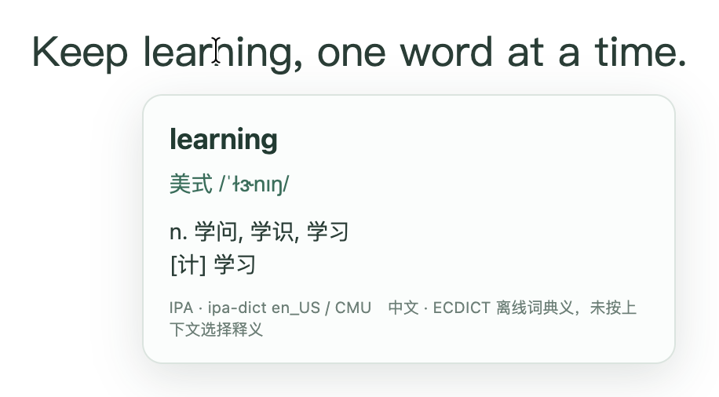
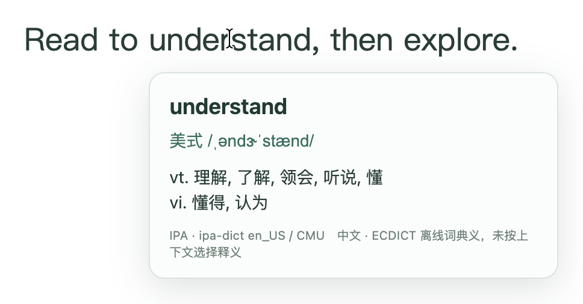

# 顺手读：让英文阅读和学习一起发生

用英语学习或工作时，你可以继续读英文原文，遇到不懂的单词，把鼠标停上去，就能看到中文释义和美式音标。

**先启用当前网页，之后逐词悬停即可，不需要点击每个单词。**理解意思，也留意发音，让英文阅读和学习一起发生。

*鼠标停在 learning 上，释义与音标出现在单词下方。*

## 适合谁

- 用英语学习或工作，希望保留原文阅读，同时理解词义、学习发音的人。
- 阅读英文课程、文章或工作资料，想逐词确认含义的人。
- 希望查词工具简单，不用注册账号、付费 API 或配置密钥的人。

## 跟着自己的阅读节奏查词

想了解哪个词，就把鼠标停在哪个词上。片刻后出现释义窗口，移开就收起，不改变网页排版。

*保留英文句子，按需查看 understand 的意思和美式音标。两张图均为 4.0 在本地英文演示页的真实悬停截图，包含系统文字指针。*

查词在电脑本地完成，不上传网页内容、查词内容或浏览历史。词库随扩展提供，查词本身不需要联网；输入框、密码框和可编辑区域不取词。

## 第一次怎么用

目前提供 Mac Chrome 本地安装版，尚未上架 Chrome 商店。

1. 下载 [4.1 扩展包](https://github.com/janiezhang52-lab/shunshou-reader/releases/download/v4.1/shunshou-reader-4.1-extension.zip)，解压并保留文件夹。
2. 在 Chrome 打开 chrome://extensions/，开启“开发者模式”。
3. 点击“加载已解压的扩展程序”，选择解压后的 extension 文件夹。
4. 打开英文网页，点击工具栏里的顺手读，选择“启用当前页”。
5. 开始阅读，把鼠标停在想查的英文单词上。

全页刷新或打开新标签页后，需要重新启用；阅读中可以随时暂停当前页。

## 使用前了解这些

显示的是词典释义，暂时不会根据整句话选择最合适的词义。部分词可能没有音标或释义，缺失时会明确提示。

4.1 补上同源嵌套课件、动态加载的内嵌正文、网页组件、只读表单说明和代码块中的英文取词。仍使用当前页面授权，不申请持续访问所有网站。

已在真实 Chrome 中验证 OpenAI Academy、Wikipedia、Python、MDN、GitHub 共 5 个网站、6 个内容页面。验证覆盖 Academy 深层正文和互动卡片、课程目录往返、工具栏暂停与恢复、Python 代码注释，以及 GitHub 从 README 导航到 CONTRIBUTING 后继续查词。Academy 未解锁的后续章节未计为通过。

**浏览器内部页、图片文字和未授权跨域嵌入暂不支持。** 扩展商店、内置 PDF 查看器和 Canvas 中的文字也暂不支持。

具体页面、悬停单词和场景结果见 [验收报告](TEST-REPORT.md)。ChatGPT Learn 尚未完成验证。本项目与 OpenAI 没有官方关联。

## 免费个人使用

作者：[宁宁](https://github.com/janiezhang52-lab)。原创程序允许免费个人使用和原样免费分享，不允许出售软件副本或将修改版公开发布。第三方词库保留各自原许可，详细条件见仓库许可文件。

[查看项目与源码](https://github.com/janiezhang52-lab/shunshou-reader)

[4.1 下载页面](https://github.com/janiezhang52-lab/shunshou-reader/releases/tag/v4.1)提供扩展包、[完整源码包](https://github.com/janiezhang52-lab/shunshou-reader/releases/download/v4.1/shunshou-reader-4.1-source.zip)和 [SHA-256 校验文件](https://github.com/janiezhang52-lab/shunshou-reader/releases/download/v4.1/SHA256SUMS-4.1.txt)。

已安装旧版时，先备份旧文件夹，再替换扩展文件并在 Chrome 扩展管理页点击重新加载；也可停用旧版后加载新的 `extension` 文件夹，避免同页同时启用两个版本。刷新阅读页后重新启用顺手读。
