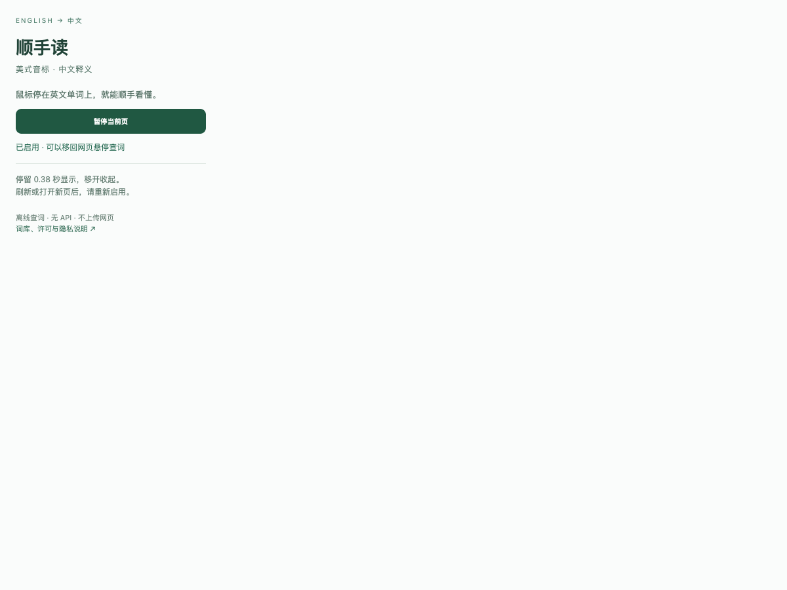
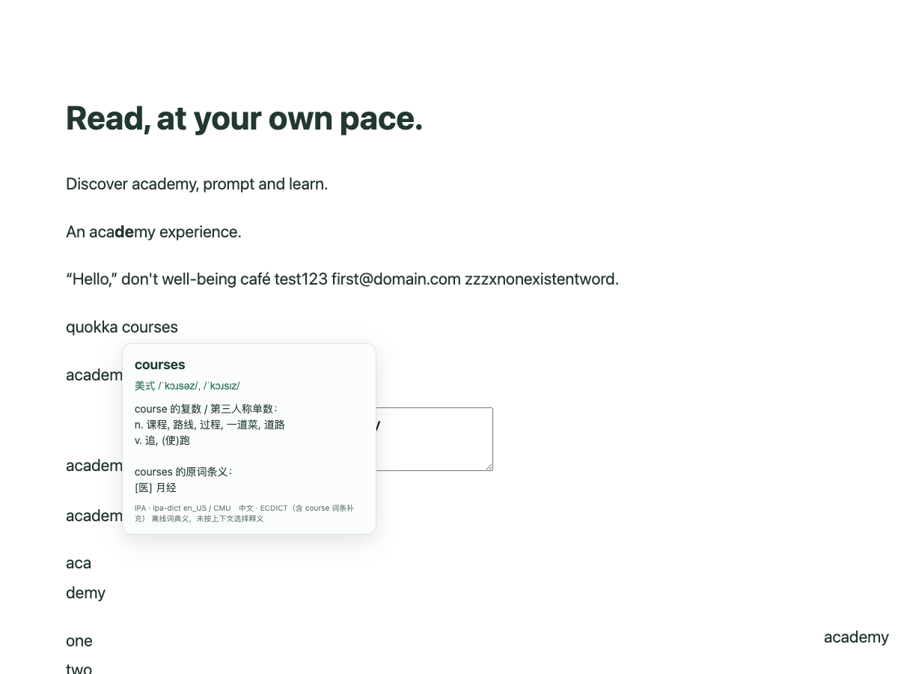

# 顺手读 4.0

读英文网页时，把鼠标停在单词上，就能看到美式 IPA 音标和中文释义。适合想少切换页面、顺手读英文的人。

查词在本机离线完成，不需要付费 API、账号或密钥。每个网页由你主动启用，刷新或打开新页面后重新启用。

上图来自未登录的真实 Academy 页面。顺手读是独立个人项目，与 OpenAI 没有官方关联。也可在其他普通英文网页试用；不保证所有网站兼容。ChatGPT Learn 尚未完成页面验证。

## 安装与第一次使用

1. 下载发布附件 `shunshou-reader-4.0-extension.zip`，解压，并保留解压后的文件夹。准备发布期间远程下载地址尚未生成。
2. 在 Chrome 地址栏打开 `chrome://extensions/`，开启右上角“开发者模式”。这是加载本地扩展所需的操作，不需要修改其他安全设置。
3. 点击“加载已解压的扩展程序”（部分版本显示“加载未打包的扩展程序”），选择解压后的 `extension` 文件夹。
4. 打开要阅读的英文网页，点击工具栏里的“顺手读”，启用当前页。找不到图标时，可以先在拼图形状的扩展菜单中固定它。
5. 把鼠标停在英文单词上约 0.38 秒；移开后释义收起。刷新或打开新页后，点扩展重新启用。

暂停：在顺手读弹窗中选择“暂停当前页”。卸载：在 Chrome 扩展页移除顺手读。如果已安装旧版本，请先保留备份，停用旧扩展再加载新版，避免同页同时启用两个版本。本项目没有在 Chrome 商店上架。

## 它能显示什么

- 美式音标来自 ipa-dict 明确标记的 General American 数据，原样显示已收录词形的 IPA，不猜读音。
- 释义来自 ECDICT。缺词、缺音标或缺释义时明确显示缺失。
- `courses` 会显示 `course` 里包含“课程”的释义，并保留 `courses` 的原词条义和自身音标。这个已核对的特定补充不等于通用去词尾猜词。
- 悬停窗口不改变网页排版；快速移过单词时延迟显示，避免闪动。

完整离线数据包含 440,843 个词形，其中 124,987 有美式 IPA、399,213 有非空释义字段、83,357 两者都有。与第一版完整词库相同。这些是词形数量，不是阅读命中率；非空释义字段也不代表逐项均为中文或已人工校对。

## 隐私与权限

只有 `activeTab` 和 `scripting` 两项生产权限。点击扩展时，Chrome 允许扩展读取当前页文字并注入查词界面；没有常驻全部网站的权限。查词只发送单个词形到扩展自己的本地后台，词库从扩展包加载。

不上传网页、查词内容或浏览历史，不联系在线词典，不含分析统计。输入框、密码框和可编辑区域不取词。看完可暂停当前页或移除扩展。

## 已知限制

- 提供词典义，不根据句子选择词义；旧义、专业义、释义错误及上游音标误差可能存在。
- 新词、专名、部分词形可能缺失。美式音标和中文的覆盖范围不同。
- Chrome 内部页面、图片文字、部分 PDF 及跨域 iframe 不支持；一些网站的特殊文字布局可能无法准确取词。
- 本版在 Mac Chrome 试用并由使用者确认可用；不承诺已经测试所有系统、浏览器或网站。

## 许可：原创程序与词库分开

**原创程序和原创说明采用专用许可，不是 MIT，也不是 OSI 开源许可。**允许免费个人使用和原样免费分享；禁止出售软件副本及修改后公开发布。私人本地修改的条件及其他细节以 [LICENSE](LICENSE) 原文为准。此前旧版已合法授予的 MIT 权利不会被撤回。

**ECDICT 和 IPA 等第三方数据保留各自原许可。**软件专用限制不能覆盖这些数据已有的提取、修改、分享或商业使用权；必须保留相应版权、许可和其他通知。见 [第三方声明](THIRD-PARTY-NOTICES.md)、[数据来源](DATA-SOURCES.md) 与 [词库许可原文](extension/licenses)。

ECDICT 维护者明确允许数据库按 MIT 用于商业软件及随安装包离线查词；[2019 年回复](https://github.com/skywind3000/ECDICT/issues/43#issuecomment-484829135)、[2026 年回复](https://github.com/skywind3000/ECDICT/issues/134#issuecomment-5902723743)。全部历史第三方素材的逐词权利链尚未独立核清，具体依据和缺口见 [ECDICT 授权核实](ECDICT-AUTHORIZATION.md)。

## 验证与源码

本版通过 8 项查词测试、16 项浏览器流程与隐私检查，以及真实 Academy 页面验证，共 17 项浏览器检查通过。测试覆盖首次/重复悬停、标点和词边界、敏感输入避让、缺词、加载失败重试及 courses 补充。ChatGPT Learn 未找到可悬停公开文本，未记为通过。

发布附件包含扩展包、完整源码包及 SHA-256 校验文件。Mac 可在附件所在目录执行 `shasum -a 256 -c SHA256SUMS-4.0.txt` 校验。需要源码时使用 `shunshou-reader-4.0-source.zip`。

可复现命令：`npm test`；`python3 scripts/build_data.py`；`python3 scripts/package.py`。浏览器测试需要 Playwright Core 1.58.2 和兼容的 Chromium：`npm run test:browser`。测试使用独立浏览器和临时测试站点权限，不扩大生产清单权限；细节见 [验证说明](TEST-REPORT.md)。
